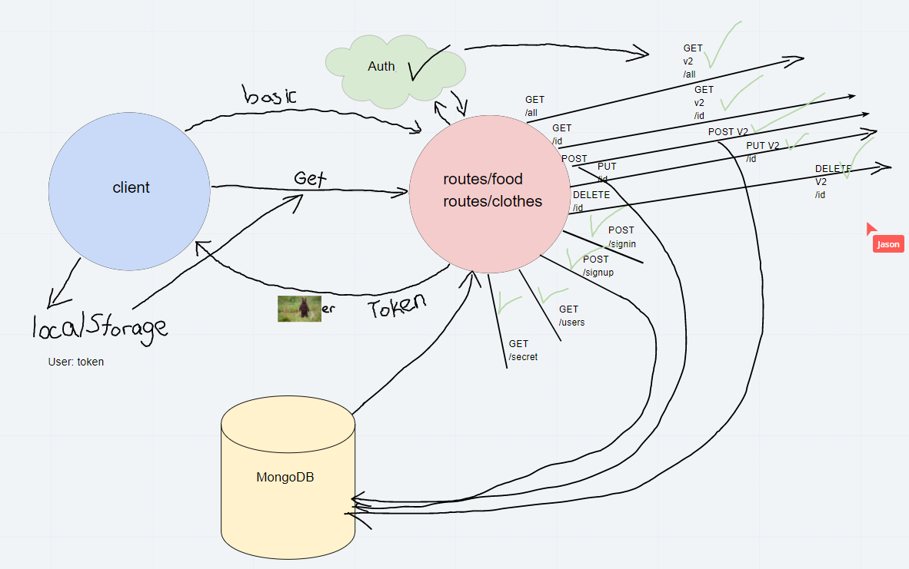

# auth-api

# Lab 08

## Author
* Nick Magruder

## Overview
* Extending the restrictive capabilities of our routes to our API, implementing a fully functional, authenticated and authorized API Server using the latest coding techniques
* Combining an API & Auth servers into a single server
* Restricting access without a valid token AND a specific capability

## User Instructions
- Deployed to Heroku, accessible at: 
    
- To run tests, clone to a directory and run npm test in directory in terminal

## UML Chart:
* 

## Credits and Collaborations
* Classmate collaborators:
* Carly Dekock
* Jason Quaglia
* Jason Dormier
* Seid MO